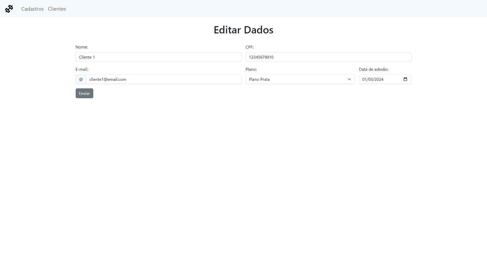

# Sistema de Academia com Django

Este é um sistema básico (CRUD) para controle de clientes de uma academia, desenvolvido utilizando Django, Python, HTML e Bootstrap.

## Funcionalidades

- **Cadastro de Clientes**: Permite o registro de novos clientes com informações como nome, CPF, e-mail, plano e data de adesão.
- **Listagem de Clientes**: Exibe uma tabela com todos os clientes cadastrados, permitindo visualizar, editar e excluir registros.
- **Edição de Clientes**: Permite a atualização das informações de um cliente existente.
- **Exclusão de Clientes**: Possibilita a remoção de um cliente do sistema.

## Tecnologias Utilizadas

- **Django**: Framework web para desenvolvimento em Python.
- **Python**: Linguagem de programação utilizada no backend.
- **HTML**: Linguagem de marcação para estruturação das páginas web.
- **Bootstrap**: Framework CSS para design responsivo e estilização.

## Imagens do Sistema

### Formulário de Cadastro


### Tabela de Clientes


### Formulário de Edição


## Instalação

Certifique-se de ter o Python 3.7 ou superior instalado em sua máquina.

1. Clone o repositório:

   ```bash
   git clone https://github.com/ianfelps/sistema_academia.git
   ```

2. Instale as dependências:

   ```bash
   pip install -r requirements.txt
   ```

## Execução

Para executar o sistema, use o seguinte comando:

```bash
cd proj_sistema_academia
python manage.py runserver
```

O sistema estará disponível localmente em `http://localhost:8000`.