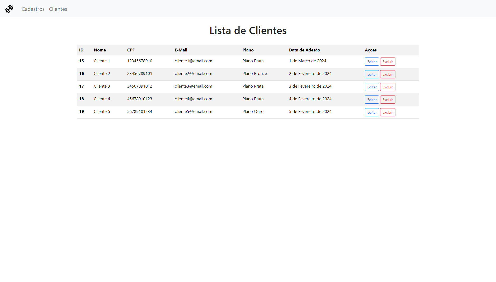

<h1>Sistema de Academia com Django</h1>

Sistema básico para cadastro de clientes de uma academia utilizando Django, Python, HTML e Bootstrap.

<ul>
    <li>
Formulário de Cadastro:
</li>
    
</ul>

<ul>
    <li>
Tabela de Clientes:
</li>
    
</ul>